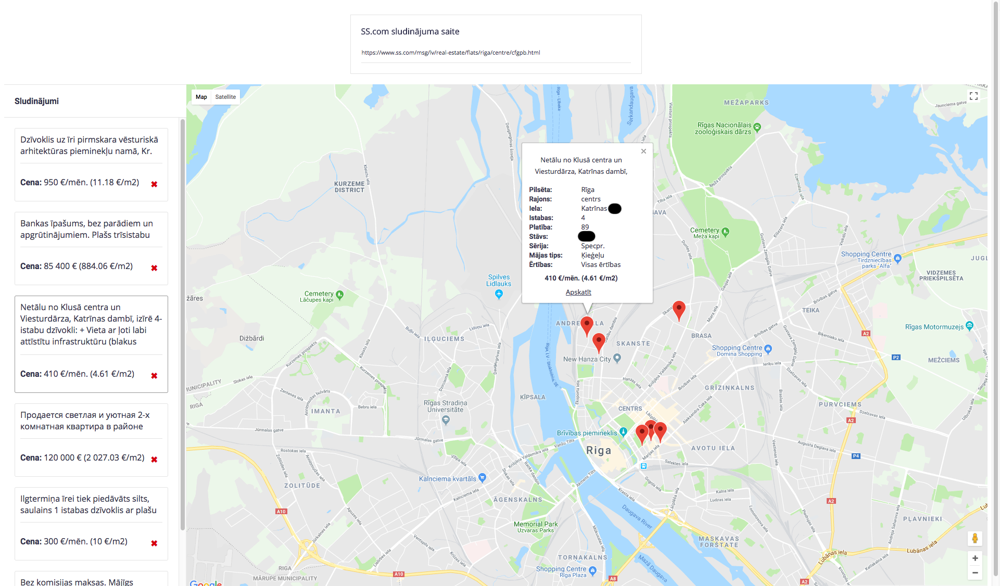

# SSMap
  
Synchronize and rate ss.lv real estate posts.  
  
  
  
## Architecture

### React frontend

- Is responsive, usable both on desktop and mobile
- Maximizes map size (as opposed to ss.lv which has a tiny map)
- Zod schemas & types for API requests (shared with backend)
- Local storage for remembering projects that have been created or opened
- URL path & query parameters for storing filters & project references
- Leaflet for rendering map & OSM as the map backend

### Koa backend

- Sqlite database to persist data
- Scheduled job to synchronize list pages, RSS feeds & individual posts
- Rate-limited fetcher to reduce load on ss.lv
- Zod schemas & types for API requests (shared with frontend)
- `JSDOM` XML & HTTP parsers for parsing ss.lv content

### Sqlite database

- `post` (individual real estate ad posts)
- `feed` (RSS feed or list page)
- `feed_post` (ties posts to feeds which contain them)
- `project` (a user-created "project" which contains a set of feeds, posts, ratings)
- `project_feed` (references to all feeds that are in a project)
- `project_post` (references individual posts that are in a project)
- `project_post_feeling` (a star-based rating as set by the user for each post)
  
## Notes
  
Good things:  
- The project has achieved the goals I needed
  - I can track ss.lv posts (and notice new posts)
  - I can rate them
  - They are all persisted in a single place
  - The map is as large as your monitor
  
Suboptimal things:  
_N.B. This is not to say that this project is bad, these are just improvements, things I didn't implement, etc._  
- OSM map data is not cached, in production users would get rate-limited and see missing tiles
- This project was initially written in JS in 2018, a recent refactor has still resulted in leftover cruft
- The parsers are brittle, ss.lv could refactor their FE and this thing would break (expected, they don't raelly have an API)
- Sqlite usage is not optimized, so it's probably slow if there's a lot of data
- Concurrency is heavily limited and could be improved (also leads to slowness)
- Loading 900 posts results in a slow laggy list element (react-virtualized could be used)
- Frontend code is full of hacks and repeated code (could clean it up)
- The parsing is bare-bones (one could parse more structured data out of the posts)
- All the build configs (webpack, tsconfig, package.json) were edited by AI, they are not good
- Hot-reload is broken - does not work (I think this was done by AI)
- There is not user authorization or permission management (I did not care about that)
- Probably many other issues/improvements could be found (but I have limited time and my personal scope for the project was also limited)
